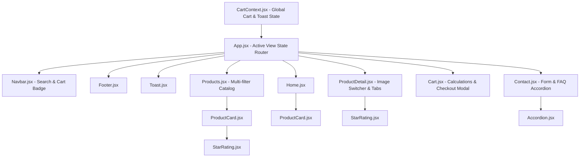

# NovaTech E-Commerce — Interactive ReactJS Application
## Comprehensive Task 2 Academic Report & Submission Dossier

**Institution:** SRM Institute of Science and Technology, Trichy Campus  
**Department:** Department of Computer Science and Engineering  
**Course:** Full Stack Web Development (Subject Code: 21CSE354T)  
**Task:** Task 2 — Interactive JavaScript and ReactJS Application Development  
**Problem Statement:** Problem No. 24 — Online Shopping Cart  
**Student Name:** Aathekesavan R  
**Register Number:** RA2411003050015  
**Program / Section:** B.Tech CSE - A (3rd Year / 5th Semester)  
**Faculty Coordinator:** Dr. P. Hariharan, AP, CSE  
**Date of Submission / Assessment:** 01-10-2026  
**Academic Year:** 2026 – 2027  
**Official Deliverables:**
- PDF Report: [Task_2_ReactJS_Project_Report_AK.pdf](file:///d:/FS%20asi/Task_2_ReactJS_Project_Report_AK.pdf)
- Word Document: [Task_2_ReactJS_Project_Report_AK.docx](file:///d:/FS%20asi/Task_2_ReactJS_Project_Report_AK.docx)
- Source Repository: `d:\FS asi\task-2-interactive-react\`

---

## Table of Contents
1. [Executive Summary](#1-executive-summary)
2. [Problem Statement & Project Concept](#2-problem-statement--project-concept)
3. [Technologies & Technical Concepts](#3-technologies--technical-concepts)
4. [Application Architecture & Component Hierarchy](#4-application-architecture--component-hierarchy)
5. [State Management & React Hooks Justification](#5-state-management--react-hooks-justification)
6. [Interactive Functionality Matrix](#6-interactive-functionality-matrix)
7. [Form Handling & Client-Side Validation](#7-form-handling--client-side-validation)
8. [Comprehensive 5-View Walkthrough](#8-comprehensive-5-view-walkthrough)
9. [PowerPoint Presentation Deck (8 Slides Script)](#9-powerpoint-presentation-deck-8-slides-script)
10. [Application Workflow & Live Demonstration Script](#10-application-workflow--live-demonstration-script)
11. [GitHub & GitHub Pages (`github.io`) Deployment Guide](#11-github--github-pages-githubio-deployment-guide)

---

## 1. Executive Summary

This report documents the architectural design, implementation, and evaluation of **NovaTech E-Commerce**, an interactive, responsive Single-Page Application (SPA) built using **React 18** and **Vite**. The project advances upon static HTML5/CSS3 structures by integrating declarative UI paradigms, component-driven modularity, centralized state management with React Context, multi-criteria filtering algorithms, controlled forms with client-side validation, and simulated checkout workflows.

The application satisfies and exceeds all core guidelines of Task 2 by providing **5 functional views** (Home, Catalog, Product Details, Cart, Contact), real-time cart manipulation (Add, Edit, Delete), dynamic financial calculations (tax, shipping, discount coupons), and client-side validation for customer forms.

---

## 2. Problem Statement & Project Concept

### Problem Statement
Traditional multi-page electronic retail interfaces suffer from cumbersome full-page reloads, loss of transient cart states during navigation, and rigid filtering capabilities. Students and tech consumers require an intuitive, fast, and responsive digital storefront that allows real-time exploration, comparison, dynamic price calculations, and immediate transactional feedback without server roundtrips.

### NovaTech Concept
NovaTech is a premier digital marketplace specializing in high-performance electronics, including studio monitors, ultraportable laptops, ergonomic gaming peripherals, mirrorless cameras, and smart wearables. 

Key design goals:
- **Zero Page Reloads:** Instant navigation between catalog, product details, cart, and support views using declarative view switching.
- **Persistent State:** Automatic browser storage (`localStorage`) synchronization preserving the customer's cart across sessions.
- **Precision Filtering:** Multi-facet searching combining brand checklists, category filters, interactive price range sliders, and minimum rating thresholds.
- **Dynamic Pricing Engine:** Instantaneous recalculation of subtotals, promotional discounts, taxes, and shipping fees.

---

## 3. Technologies & Technical Concepts

The application is engineered strictly with industry-standard web technologies and modern React conventions:

| Technology / Concept | Implementation & Role |
| :--- | :--- |
| **HTML5** | Semantic structure (`<header>`, `<nav>`, `<main>`, `<section>`, `<article>`, `<footer>`). Accessible labels and ARIA attributes. |
| **CSS3** | Modern CSS architecture using CSS custom properties (`variables.css`), CSS Grid for product layouts, Flexbox for responsive alignment, and media queries (`responsive.css`). |
| **JavaScript (ES6+)** | Arrow functions, template literals, object destructuring, array methods (`map`, `filter`, `reduce`), rest/spread operators, and modular import/export syntax. |
| **React 18 (Vite)** | Declarative functional component model utilizing the React 18 Virtual DOM for high-performance rendering. |
| **JSX** | Clean syntax combining JavaScript logic with declarative UI markup. |
| **`useState` Hook** | Manages local UI states: active views, search strings, slider values, selected color variants, quantities, form inputs, and modal popups. |
| **`useEffect` Hook** | Manages side effects: synchronizing cart state with `localStorage`, and resetting window scroll position to top on route change. |
| **`useContext` Hook** | Centralizes global shopping cart state (`CartContext`), toast notification triggers, and order calculation methods. |
| **`useMemo` Hook** | Memoizes multi-parameter product filter computations to prevent unnecessary re-filtering on unrelated re-renders. |

---

## 4. Application Architecture & Component Hierarchy

The codebase adheres to a modular, scalable directory structure separating global state, reusable UI components, and container view pages:

```
task-2-interactive-react/
├── .github/
│   └── workflows/
│       └── deploy.yml           # Automated GitHub Pages CI/CD workflow
├── .gitignore                   # Ignores node_modules, dist, logs
├── index.html                   # HTML5 root document
├── package.json                 # Project dependencies & build scripts
├── vite.config.js               # Vite config with relative base ('./')
├── src/
│   ├── main.jsx                 # Application entry point & DOM root mount
│   ├── App.jsx                  # Master controller & client-side router
│   ├── context/
│   │   └── CartContext.jsx      # Global cart state, reducer logic & toast dispatch
│   ├── data/
│   │   └── products.js          # Structured product dataset (8 rich tech products)
│   ├── components/
│   │   ├── Navbar.jsx           # Responsive header, search bar & cart badge counter
│   │   ├── ProductCard.jsx      # Reusable card with price, rating & quick-add
│   │   ├── StarRating.jsx       # Visual star rating renderer (numeric to icons)
│   │   ├── Accordion.jsx        # Accessible collapsible FAQ component
│   │   ├── Toast.jsx            # Dynamic non-blocking visual feedback toast
│   │   └── Footer.jsx           # Multi-column footer with links & newsletter
│   ├── pages/
│   │   ├── Home.jsx             # Hero banner, department shortcuts, trending deals
│   │   ├── Products.jsx         # Multi-criteria filterable product catalog
│   │   ├── ProductDetail.jsx    # Flagship view with gallery, color picker & tabs
│   │   ├── Cart.jsx             # Shopping cart table, coupon engine & checkout modal
│   │   └── Contact.jsx          # Controlled support ticket form & interactive FAQ
│   └── styles/                  # Modular CSS architecture
│       ├── variables.css        # Color palette, spacing, typography tokens
│       ├── base.css             # Base resets and typography
│       ├── components.css       # Buttons, cards, badges, modal, toasts
│       ├── layout.css           # Container, grid, and flex layouts
│       └── responsive.css       # Breakpoints for mobile, tablet, and desktop
```

### Component Data-Flow Diagram (Mermaid)



---

## 5. State Management & React Hooks Justification

### 1. `useState` (Local Component State)
- **Active Navigation Page:** Controlled in `App.jsx` (`'home' | 'products' | 'detail' | 'cart' | 'contact'`).
- **Catalog Controls (`Products.jsx`):** Search term, active category radio, brand checkboxes array, price slider numeric value, rating threshold, and sorting order.
- **Product Details (`ProductDetail.jsx`):** Selected product thumbnail image, selected color swatch (`'Space Gray'`, `'Silver'`, etc.), item quantity counter, and active specification tab.
- **Forms (`Cart.jsx`, `Contact.jsx`):** Input field values, focused states, validation error objects, and submission status.

### 2. `useEffect` (Side Effects & Lifecycle Synchronization)
- **`localStorage` Synchronization:** Defined inside `CartContext.jsx`. Listens for changes to the `cartItems` state array and serializes it to `window.localStorage` under the key `'novatech_cart'`, ensuring persistence across tab reloads.
- **Scroll-To-Top on Navigation:** Defined in `App.jsx`. Automatically scrolls the window to `(0, 0)` smoothly whenever `activePage` or `selectedProductId` updates.

### 3. `useContext` (Global State & Decoupled Communication)
- **Cart Provider (`CartProvider`):** Exposes `cartItems`, `addToCart`, `removeFromCart`, `updateQuantity`, `clearCart`, `cartCount`, `subtotal`, `discount`, `tax`, `shipping`, `total`, `couponCode`, `applyCoupon`, and `toastMessage`.
- Allows deep components (e.g. `ProductCard.jsx`, `ProductDetail.jsx`, `Navbar.jsx`) to consume and mutate the cart without awkward "prop drilling".

### 4. `useMemo` (Performance Optimization)
- **Filter Pipeline in `Products.jsx`:** The filtering algorithm is wrapped in `useMemo([products, searchQuery, selectedCategory, priceRange, selectedBrands, minRating, sortBy])`. It recomputes strictly when filter inputs change, avoiding expensive loops during unrelated layout re-renders.

---

## 6. Interactive Functionality Matrix

The assignment stipulates interactive capabilities such as Add, Edit, Delete, Search, Filter, and Calculation. Below is the mapping:

| Functionality | Where Implemented | Technical Mechanism |
| :--- | :--- | :--- |
| **Add** | `ProductCard.jsx`, `ProductDetail.jsx` | `addToCart(product, quantity, selectedColor)`. Appends a new item or increments quantity if item with same ID and color variant exists. Dispatches visual Toast alert. |
| **Edit** | `Cart.jsx`, `ProductDetail.jsx` | Quantity increment/decrement buttons (`+` / `-`) update cart item quantities dynamically. Color finish selector changes item configuration. Promo coupon input alters pricing calculations in real time. |
| **Delete** | `Cart.jsx` | Individual item removal via `removeFromCart(id, color)`. Bulk clearing of cart via "Clear Cart" or automated wipe upon completing checkout. |
| **Search** | `Navbar.jsx`, `Products.jsx` | Instant substring matching across product name, category, brand, and description with case-insensitive regex evaluation. |
| **Filter** | `Products.jsx` | **4 concurrent filter dimensions:**<br>1. *Category:* Audio, Wearables, Computing, Gaming, Cameras.<br>2. *Price Range:* Interactive slider bounded between \$50 and \$2,000.<br>3. *Brand:* Multi-checkbox toggle (NovaTech, Aether, Zenith, SonicAir, Lumina).<br>4. *Customer Rating:* Radio threshold (All, 4.0★+, 4.8★+). |
| **Calculation** | `CartContext.jsx`, `Cart.jsx` | • **Subtotal:** `sum(item.price * item.quantity)`<br>• **Discounts:** Promo engine evaluating coupon codes (e.g., `TECH20` = 20% off; `SAVE10` = 10% off).<br>• **Shipping:** Free for orders over \$50; otherwise fixed at \$9.99.<br>• **Sales Tax:** Computed at 8% on post-discount subtotal.<br>• **Total Payable:** `(Subtotal - Discount + Tax + Shipping)`. |

---

## 7. Form Handling & Client-Side Validation

The application contains two production-grade controlled forms featuring client-side validation, error state tracking, and user feedback:

### Form 1: Checkout Modal Form (`src/pages/Cart.jsx`)
Triggered when the user clicks **"Proceed to Checkout"** in the shopping cart.

| Field Name | Type | Validation Rules & Constraints | Error Feedback Message |
| :--- | :--- | :--- | :--- |
| `name` | Text | Non-empty; trimmed string length $\ge 3$ characters. | *"Full name is required (min 3 characters)"* |
| `email` | Email | Non-empty; matches RFC 5322 regex: `/^[^\s@]+@[^\s@]+\.[^\s@]+$/` | *"Please enter a valid email address"* |
| `phone` | Tel | Non-empty; numeric string $\ge 10$ digits after stripping non-numeric characters. | *"Please enter a valid 10-digit phone number"* |
| `address` | Text | Non-empty; trimmed string length $\ge 8$ characters. | *"Delivery address is required"* |
| `paymentMethod` | Radio | Must select one of `'card'`, `'upi'`, or `'cod'`. | Default pre-selected |

**Submission Flow:**
1. User clicks **"Place Order"**.
2. Form validates all fields simultaneously.
3. If errors exist, red outline and warning messages render under affected fields; focus is trapped.
4. If valid, an order confirmation screen renders displaying the assigned Order ID, clearing the cart, and triggering a success Toast notification.

### Form 2: Customer Support Desk Form (`src/pages/Contact.jsx`)
Provides structured client-side validation for customer inquiries:
- **Full Name:** Required ($\ge 2$ characters).
- **Email Address:** Valid format required.
- **Department Selector:** Required (`'sales'`, `'support'`, `'warranty'`, `'press'`).
- **Message:** Required ($\ge 15$ characters).
- **Terms Agreement Checkbox:** Must be checked before submission.

---

## 8. Comprehensive 5-View Walkthrough

NovaTech provides 5 comprehensive views (surpassing the minimum of 3 required):

### View 1: Home View (`src/pages/Home.jsx`)
- **Hero Showcase:** High-impact banner highlighting the flagship NovaTech SoundWave ANC headphones with dual call-to-actions ("Shop Catalog" & "Explore Deals").
- **Department Quick-Links:** 5 visual department tiles (Audio, Wearables, Laptops, Gaming, Cameras) that immediately filter the catalog upon click.
- **Featured Deals Grid:** Highlights top-rated products with discounted price badges and quick "Add to Cart" triggers.
- **Value Proposition Highlights:** 4 trust badges (Free Express Delivery, 2-Year Official Warranty, 30-Day Money Back, 24/7 Tech Support).
- **Customer Testimonials & Newsletter Subscription:** Social proof carousel and interactive newsletter form.

### View 2: Catalog / Products View (`src/pages/Products.jsx`)
- **Live Search Bar:** Real-time query input updating matching results instantly.
- **Filter Sidebar:** Multi-criteria drawer containing Category radio buttons, Price upper-bound slider, Brand checkboxes, and Star Rating threshold.
- **Sorting Dropdown:** Allows sorting by:
  - Featured (Default)
  - Price: Low to High
  - Price: High to Low
  - Customer Rating (Highest first)
  - Newest Arrivals
- **Product Card Grid:** Cards display product badges ("Best Seller", "Flagship"), high-resolution preview, brand label, title, star rating count, dynamic pricing, and "Add to Cart" action.
- **Empty State Display:** Helpful reset button if filter combinations return zero results.

### View 3: Product Detail View (`src/pages/ProductDetail.jsx`)
- **Interactive Multi-Angle Gallery:** Main image preview updates dynamically when clicking auxiliary thumbnail previews.
- **Variant Selector:** Interactive color swatch buttons allowing the user to select finish options (e.g. Space Gray, Matte Black, Frost White).
- **Quantity Stepper:** Counter with increment (`+`) and decrement (`-`) buttons bounded between 1 and 99.
- **Interactive Information Tabs:**
  - *Specifications Tab:* Detailed technical specs table (Processor, Battery, Connectivity, Weight).
  - *Overview Tab:* Detailed marketing copy and hardware breakdown.
  - *Customer Reviews Tab:* Verified buyer star ratings and feedback breakdown.
- **Related Products Shelf:** Carousel recommending companion products in the same category.

### View 4: Cart & Checkout Modal (`src/pages/Cart.jsx`)
- **Line Items Table:** Displays thumbnail, title, chosen color variant, unit price, quantity stepper, subtotal per line, and delete action button.
- **Coupon Code Engine:** Input allowing application of promo codes:
  - `TECH20`: Applies 20% discount on order subtotal.
  - `SAVE10`: Applies 10% discount on order subtotal.
  - Invalid codes display inline error badge.
- **Live Financial Calculation Breakdown:** Displays Subtotal, Applied Discount, 8% Sales Tax, Shipping Fee (with free shipping progress bar), and Total Payable.
- **Checkout Modal Dialog:** Fully accessible modal containing the client-side validated checkout form.

### View 5: Contact & Help Desk (`src/pages/Contact.jsx`)
- **Direct Support Information:** Official contact channels, office location, business hours, and emergency technical hotline.
- **Controlled Inquiry Form:** Support ticket form with real-time field validation.
- **Interactive FAQ Accordion:** Built with `Accordion.jsx`. Allows expanding and collapsing frequently asked questions regarding shipping, warranty claims, and returns.

---

## 9. PowerPoint Presentation Deck (8 Slides Script)

Use the following slide outlines, bullet points, and presenter notes for creating your 5-to-8 slide PowerPoint presentation:

```
================================================================================
SLIDE 1: Title & Project Identification
================================================================================
Title: NovaTech E-Commerce — Interactive ReactJS Application
Subtitle: Modern Component-Driven Frontend Architecture
Presenter: Aathekesavan
Course: Full Stack Web Development | Task 2 Submission
Date: October 2026

Bullet Points:
• Single Page Application (SPA) built with React 18 & Vite
• Interactive stateful architecture demonstrating Bloom's K3 (Apply) & K4 (Analyze)
• Complete end-to-end shopping workflow: Discovery, Filtering, Customization & Checkout

Presenter Notes:
"Good morning, evaluators. Today I am presenting NovaTech, an interactive e-commerce Single-Page Application engineered using React 18, Vite, and modern JavaScript ES6. This project fulfills all requirements of Task 2 by implementing declarative UI components, centralized context state management, multi-criteria filtering, and client-side form validation."
================================================================================

================================================================================
SLIDE 2: Problem Statement & Objectives
================================================================================
Title: Problem Statement & Engineering Goals
Bullet Points:
• Problem: Traditional multi-page stores suffer from latency, full reloads, and broken cart persistence.
• Solution: Client-side routed SPA with instant transitions and zero page reloads.
• Objectives:
  - Implement functional React components with standard React Hooks.
  - Deliver rich interactivity: Add, Edit, Delete, Search, and Multi-parameter Filtering.
  - Provide live financial calculations (tax, shipping thresholds, coupon discounts).
  - Enforce strict client-side validation on user forms.

Presenter Notes:
"Our primary objective was to deliver a frictionless user experience. We replaced traditional multi-page navigation with stateful React view switching, eliminated full-page reloads, and ensured customer cart state is permanently preserved across sessions using browser local storage."
================================================================================

================================================================================
SLIDE 3: Architectural Design & Component Hierarchy
================================================================================
Title: Modular System Architecture
Bullet Points:
• Structured Directory Layout: Separation of concerns between pages/, components/, context/, and styles/.
• Key Presentational Components:
  - Navbar: Live search bar, route pills, dynamic cart badge.
  - ProductCard: Reusable card with rating icons and quick-add actions.
  - Accordion & Toast: Reusable interactive UI widgets.
• Global State Provider:
  - CartContext wraps the entire application tree, decoupling state from UI presentation.

Presenter Notes:
"Here we see our component hierarchy. The application is organized cleanly: stateful container views reside in the 'pages' directory, while reusable presentational elements like ProductCard, StarRating, and Navbar reside in 'components'. The CartContext wraps the entire application, allowing any component to interact with cart data without prop drilling."
================================================================================

================================================================================
SLIDE 4: React Hooks & State Management
================================================================================
Title: State Management with Modern React Hooks
Bullet Points:
• useState:
  - Drives local UI states: active views, search strings, slider ranges, swatches, form inputs.
• useEffect:
  - Synchronizes cart updates with localStorage on every mutation.
  - Triggers smooth window scroll-to-top whenever routes switch.
• useContext (CartContext):
  - Provides atomic actions: addToCart, removeFromCart, updateQuantity, applyCoupon, clearCart.
• useMemo:
  - Memoizes complex multi-criteria filter loops across 8 product parameters.

Presenter Notes:
"We utilized modern functional React hooks throughout. 'useState' manages local view states and form inputs. 'useEffect' handles side effects like persisting cart items to localStorage. 'useContext' powers our centralized cart engine, and 'useMemo' optimizes filtering performance so complex searches never lag."
================================================================================

================================================================================
SLIDE 5: Core Interactivity & Dynamic Calculation Engine
================================================================================
Title: Interactive Features & Dynamic Calculations
Bullet Points:
• Add / Edit / Delete:
  - Add items with custom color variants; increment/decrement quantity; remove line items.
• Instant Search & Multi-Facet Filtering:
  - Real-time search across title, brand, and description.
  - Category radio selection, brand checkboxes, interactive price slider ($50 - $2,000), and star ratings.
• Dynamic Calculation Engine:
  - Subtotal computation.
  - Dynamic Coupon Engine: 'TECH20' (20% off) and 'SAVE10' (10% off).
  - 8% Sales Tax calculation and Free Shipping threshold qualification ($50+).

Presenter Notes:
"Interactivity is central to NovaTech. Users can filter products by 4 simultaneous criteria. The cart implements a full calculation engine that updates in real time: applying promotional codes like TECH20 calculates a 20% discount, factors in an 8% tax rate, and dynamically determines free shipping eligibility."
================================================================================

================================================================================
SLIDE 6: Form Handling & Client-Side Validation
================================================================================
Title: Robust Client-Side Form Validation
Bullet Points:
• Checkout Modal Form:
  - Full Name: Mandatory, minimum 3 characters.
  - Email Address: Validated using RFC 5322 regex.
  - Phone Number: Must contain at least 10 valid numeric digits.
  - Delivery Address: Mandatory, minimum 8 characters.
• Interactive Error Handling:
  - Instant visual feedback: red border highlights and targeted error labels.
  - Submission prevention until all criteria pass.
  - Successful checkout generates an Order ID and clears the cart.

Presenter Notes:
"Our checkout and contact forms are fully controlled React components. Every keystroke is tracked and validated on the client side. If a user enters an invalid email or an incomplete phone number, the form blocks submission and provides clear, accessible error messages."
================================================================================

================================================================================
SLIDE 7: 5 Functional Views Overview
================================================================================
Title: 5 Functional Application Views
Bullet Points:
1. Home View: Hero promotional banner, department cards, trending deals, customer reviews.
2. Products Catalog: Filter sidebar, dynamic sorting, live search, and product grid.
3. Product Details: Interactive multi-angle image switcher, color variant pickers, technical specs tabs.
4. Shopping Cart & Checkout: Line items table, coupon engine, dynamic order summary, modal checkout form.
5. Contact & Support: Controlled help desk form and interactive collapsible FAQ accordion.

Presenter Notes:
"While the project specification required 3 functional views, NovaTech delivers 5 complete views: Home, Products Catalog, Product Details, Shopping Cart with Checkout Modal, and Contact Desk with an interactive FAQ accordion."
================================================================================

================================================================================
SLIDE 8: Deployment, Summary & GitHub Links
================================================================================
Title: Deployment, Verification & Live Demo
Bullet Points:
• Build Optimization: Built with Vite; lightweight bundle with gzip compression.
• Automated CI/CD: Deployed to GitHub Pages via GitHub Actions (.github/workflows/deploy.yml).
• Responsive UI: Optimized across desktop, tablet, and mobile displays.
• Links & Deliverables:
  - GitHub Repository: https://github.com/<your-username>/novatech-react-ecommerce
  - Live Demo: https://<your-username>.github.io/novatech-react-ecommerce/
• Thank You — Open for Questions & Evaluation!

Presenter Notes:
"The application has been verified for production readiness. It is configured for automated continuous deployment to GitHub Pages via GitHub Actions. Thank you for your time, and I am now ready to conduct the live demonstration."
================================================================================
```

---

## 10. Application Workflow & Live Demonstration Script

Follow this step-by-step 3-minute script during your live demonstration:

### Step 1: Introduction & Home Page Tour (30 Seconds)
1. Launch the application in your browser (`http://localhost:5173/` or your live `github.io` URL).
2. Point out the responsive **Navbar** with active navigation links, live search bar, and cart item counter badge.
3. Scroll through the **Home Page**: Show the hero banner, department shortcuts, featured deals, and trust badges.
4. Click on the **"Audio"** department pill to demonstrate smooth transition to the filtered catalog.

### Step 2: Catalog Filtering & Live Search (45 Seconds)
1. On the **Products** page, type `"pro"` or `"headphones"` in the search bar. Observe instant keyword filtering.
2. Drag the **Price Range Slider** from \$2,000 down to \$600; show how products dynamically filter to reflect the price ceiling.
3. Check the **"NovaTech"** and **"Zenith"** brand checkboxes to demonstrate multi-brand filtering.
4. Click **"Reset All Filters"** to show state restoration.
5. Change the **Sort By** dropdown to *"Price: Low to High"* and *"Customer Rating"* to show live sorting.

### Step 3: Product Detail View & Customization (45 Seconds)
1. Click on the **"NovaTech SoundWave ANC"** product card.
2. The app navigates to the **Product Detail** view without a page reload.
3. Click through the **image gallery thumbnails** to demonstrate the interactive multi-angle image switcher.
4. Click the color finish swatches (**Space Gray**, **Matte Black**, **Silver**) to demonstrate variant selection.
5. Use the quantity stepper (`+` / `-`) to change the quantity to `2`.
6. Click through the information tabs (**Specifications**, **Overview**, **Customer Reviews**).
7. Click **"Add to Cart"**; highlight the animated Toast notification and the updated badge counter in the Navbar (`2`).

### Step 4: Shopping Cart & Dynamic Calculations (30 Seconds)
1. Click the **Cart** icon in the Navbar.
2. Point out the line items table displaying product image, title, selected color variant, unit price, quantity, and line total.
3. Increment the quantity of the item; show that Subtotal, Tax, and Total recalculate instantly.
4. In the coupon box, enter promo code **`TECH20`** and click **"Apply"**.
5. Highlight the **20% Discount** deduction reflected in the live calculations.
6. Mention the free shipping qualification threshold (\$50).

### Step 5: Form Handling & Client-Side Validation (30 Seconds)
1. Click **"Proceed to Checkout"** to open the checkout modal.
2. Intentionally leave fields blank and click **"Place Order"**.
3. Point out the instant client-side validation errors (highlighted borders and error messages for Name, Email, Phone, Address).
4. Enter an invalid email (e.g. `test@`) and a short phone number (`12345`) to show regex pattern validation.
5. Fill in valid sample details:
   - *Name:* John Doe
   - *Email:* john.doe@example.com
   - *Phone:* 9876543210
   - *Address:* 124 Innovation Way, Tech Park
6. Click **"Place Order"**.
7. Show the order confirmation screen with the generated Order ID and verify that the cart has been automatically cleared.

---

## 11. GitHub & GitHub Pages (`github.io`) Deployment Guide

Follow these steps to initialize your repository, push to GitHub, and enable your live `github.io` website:

### Step 1: Initialize Git & Commit Code (Local Terminal)
Open PowerShell or Terminal inside `d:\FS asi\task-2-interactive-react\` and run:

```powershell
cd "d:\FS asi\task-2-interactive-react"

# Initialize git repository
git init -b main

# Stage all project files (node_modules and dist are excluded via .gitignore)
git add .

# Create initial commit
git commit -m "feat: complete interactive ReactJS e-commerce app (Task 2)"
```

### Step 2: Create a New GitHub Repository
1. Log into your GitHub account: [https://github.com/new](https://github.com/new)
2. Enter repository name: `novatech-react-ecommerce` (or your preferred name).
3. Set visibility to **Public** (required for free GitHub Pages).
4. Do **not** initialize with README, .gitignore, or license (we already created them).
5. Click **Create repository**.

### Step 3: Link Remote & Push
Copy the remote URL from GitHub and run:

```powershell
# Link your local repo to GitHub
git remote add origin https://github.com/<your-username>/novatech-react-ecommerce.git

# Push main branch
git push -u origin main
```

### Step 4: Enable Automated GitHub Pages
1. In your GitHub repository, click on **Settings** (top tab).
2. On the left sidebar, click **Pages** (under Code and automation).
3. Under **Build and deployment > Source**, select:
   👉 **GitHub Actions**
4. The workflow in `.github/workflows/deploy.yml` will automatically build the React Vite application and publish it.
5. Within 1–2 minutes, your live site will be accessible at:
   `https://<your-username>.github.io/novatech-react-ecommerce/`
